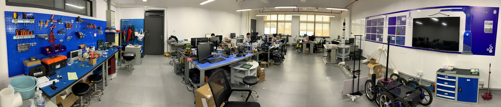

上海机器人研究由上海市高等教育局（现上海市教育委员会）于1988年在上海大学校园内成立。2019年引进马书根教授和袁建军教授，分别担任上海机器人研究所所长和常务副所长。

实验室主要依托于上海机器人研究，目前共有一名教授、两名讲师，包括袁建军教授、鲍晟讲师、杜亮讲师及博士、硕士研究生30余名，拥有100平方实验室。实验室主要从事特种机器人机构创新设计、软体仿生机器人原理和自动化装备等的研究。已获省部级以上项目10余项；授权国家发明专利20余项；获上海市科技进步二等奖一项；发表包括Automation in Construction、IEEE/ASME Transactions on Mechatronics、IEEE Robotics and Automation Letters、Industrial Robot、Scientific Reports在内的高水平SCI期刊30余篇。与清华大学、上海交通大学、上海机器人产业技术研究院和日本大阪大学、日本立命馆大学等都有深度、密切的合作。

实验室隶属的上海大学机械工程学科设立于1958年。1979年开始招收机械学硕士研究生，1990年获批机械设计及理论博士点，2001年机械电子工程入选国家重点学科，2003年获批一级学科博士点和博士后流动站，2017年列入国家“双一流”建设学科，第四轮学科评估位于B+（前11%）。是“机械电子工程” 国家重点学科、“上海市机械工程高原学科”。

## 研究内容

实验室聚焦机器人领域的前沿共性技术，致力于应用理论、技术发展的前沿成果解决生产、生活中的实际问题。研究内容涉及工业机器人、特种机器人、服务机器人、软体机器人等多个前沿热点方向。

### 机器人机构创新设计

机器人机构创新设计研究机器人的机构本体，通过新机构理论、新机构原理促进机器人技术的发展，在特种机器人构型设计、软体机器人仿生机构实现方向有重点体现。

- 5杆机构码垛机械臂研究
- 行星轮式复轮机构多轮移动底盘研究
- 应用于盾构机换刀任务的大型重载机械臂研究
- 管外打磨机器人研究
- 多种软体机器人研究

### 机器人实时控制系统

机器人实时控制系统研究特种机器人的电控系统和控制算法，通过模块化设计适应实验室多种形态、多种应用的机器人系统的控制需求。主要研究方向包括：分布式现场总线硬件架构，上位机、下位机人机交互优化设计，基于EtherCAT技术的高性能机器人实时控制系统等等。

### 机器视觉

实验室的机器视觉研究涵盖基础理论和技术应用两方面，如低纹理环境条件下的移动机器人建图定位技术研究，基于机器视觉的除锈质量检测研究等等。

## 研究生培养

实验室致力于培养机电控全面覆盖的复合型高水平专业人才，强调机构、电控、算法的交叉融合，同时注重培养学生的领导能力和团队协作能力。

### 研究生培养方案

实验室的研究生培养从招生阶段延续到毕业之后：

- 招生阶段：面试交流，确定发展方向。
- 入学前： 提供机器人基础知识学习指导。
- 研一（上）：课程学习，文献阅读。
- 研一（下）：确定研究方向，进入课题组。
- 研二（上）：主要科研工作。
- 研二（下）：主要科研工作。
- 研三（上）：毕业论文。
- 毕业后：定期交流。

### 研究生培养条件

实验室硬件条件，包括场地、仪器设备等等。
科研项目，包括实验室纵向横向课题，基金、项目申请等等。
产学研，
国内外交流合作，清华大学、上海交通大学、日本东京工业大学、日本大阪大学、日本立命馆大学等等。

## 毕业生统计

近期累计毕业硕士研究生13名。

### 硕士

| 毕业年份   |  人数      |     去向   |  备注     |
| --------- | ---------- | ---------- | --------- |
| 2023.4   |       5     | 小米等   |     |
| 2022.4   |       4     | 理想汽车等   |     |
| 2021.4   |       2     | 上汽集团等   |     |
| 2020.4   |       2     | ABB等       |     |